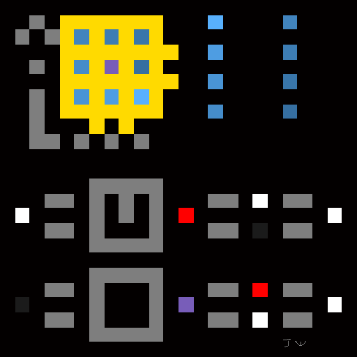

## Fez Crypt

There is a crypt in Fez which features a maze through four doors.
But also! It is a matrix of 0s and 1s. Four faces of 4x4.

Here are the faces arranged into one 8x8 matrix:
```
[[0 0 0 1 0 0 1 0]
 [0 1 0 0 1 0 0 0]
 [1 1 0 0 0 0 1 1]
 [0 0 0 1 0 1 0 0]
 [0 0 0 0 1 0 0 0]
 [0 1 0 0 0 1 0 1]
 [0 0 1 0 0 0 0 0]
 [1 0 0 0 0 0 1 0]]
```

### Header

The diagonal line of a square matrix is called its [IDENTITY](https://en.wikipedia.org/wiki/Identity_matrix).

We'll call the identity, anti-identity, and parity, the "HEADER":

```
Identity: 		'\' (92)
AntiIdentity: 	'' (1)
Parity: 		'/' (47)
```

### Rings

#### Summary

ascii rings:
```
 diagonal A: 'I' (73)
   			 'd' (100)
 diagonal B: '\`' (96)
			 '¤' (164)
```

"Id" is a clear reference to the word identity, which also calls
to mind the position of these ascii characters.

The backtick '\`' is called a "grave" which is a reference to the
crypt which contains it. [Source.](https://en.wikipedia.org/wiki/Grave_accent)

The 'currency symbol' is also called the 'scarab', making this a
clever reference to the Gold Bug cryptography story by Edgar Allen Poe. [Source.](https://en.wikipedia.org/wiki/Currency_sign_(typography))


#### How to Read

In each corner, isolate the 3x3 matrix.
Consider this matrix a ring of 8 bits with a center parity bit.

Start at the bit closest to the origin.
Read the bits by moving along the X axis away from the origin.
Then move along the Y. Spiral back to the start.



Each ring also includes a center parity bit:

```
P = b0 ^ b1 ^ b2 ... ^ b7 ^ 1
```
such that
```
b0 ^ b1 ^ b2 ... b7 ^ P = 1
```
