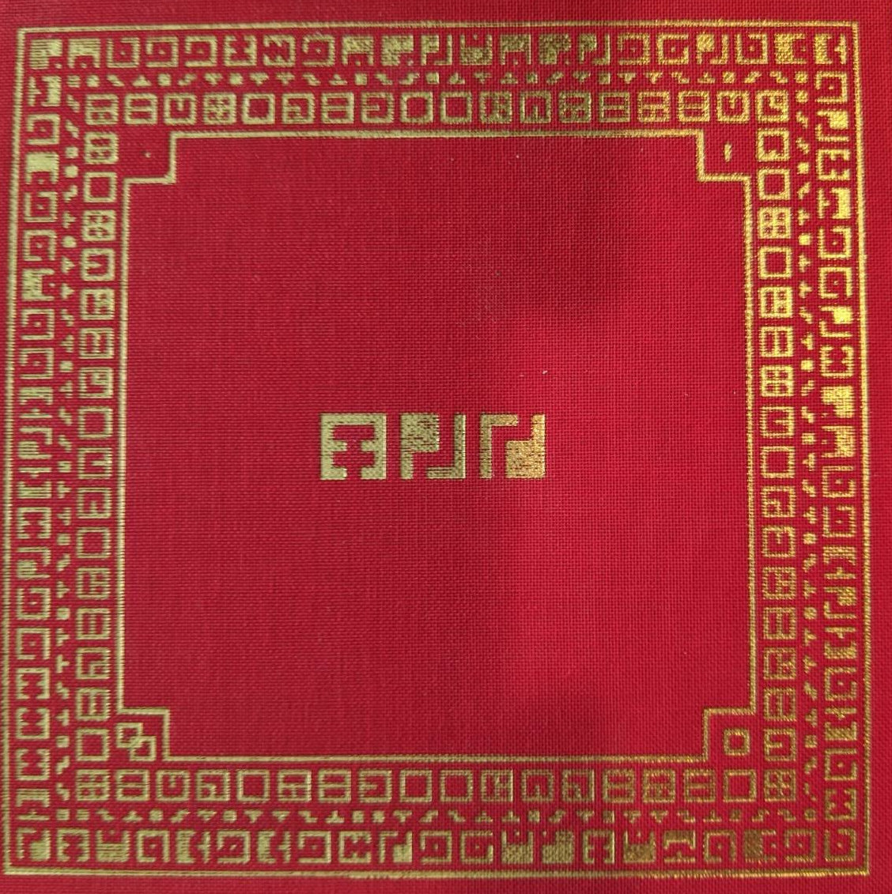
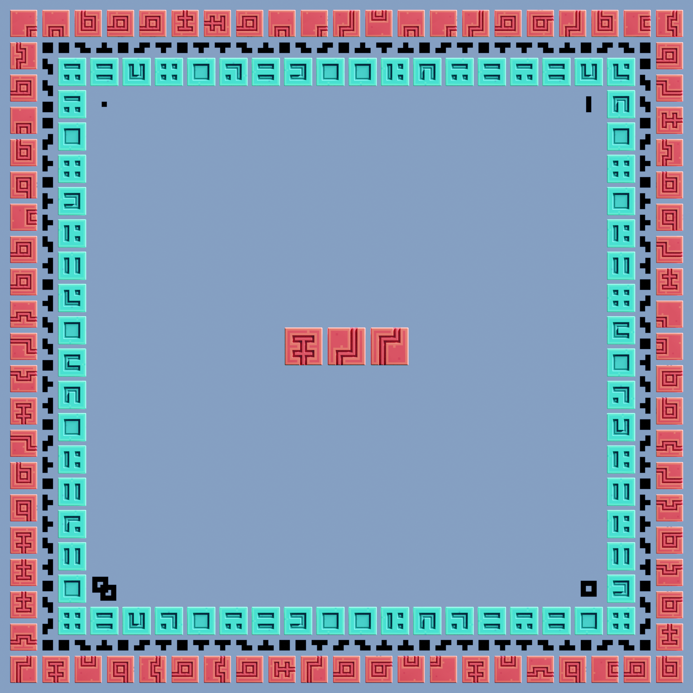
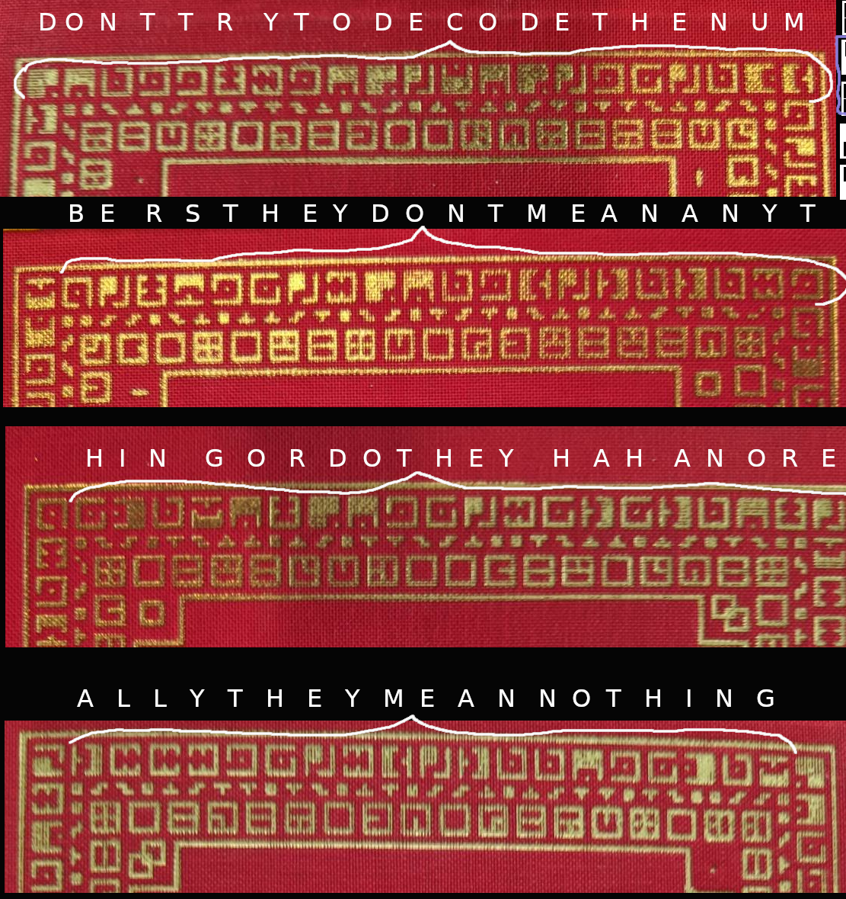
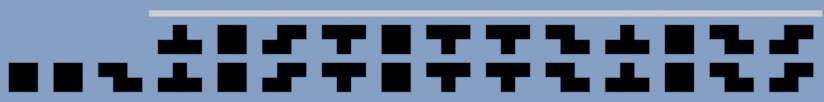
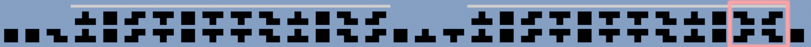
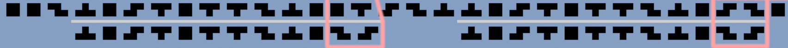
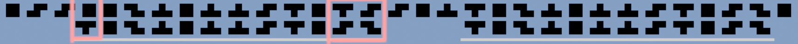
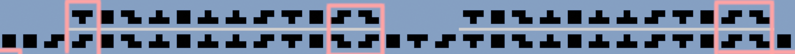
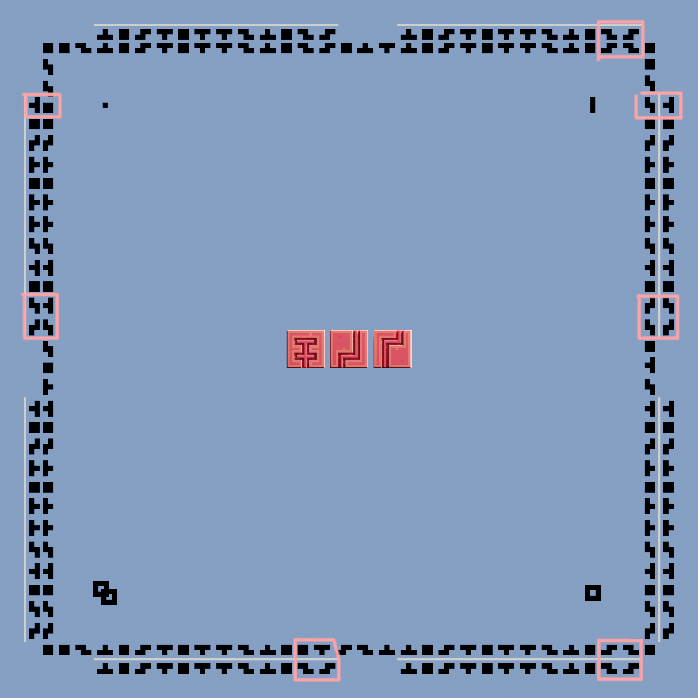

# Limited Edition Analysis

The box of the Fez limited release contains these distinct features:

- Ring of Zu Letters around the circumference of the Square
- Ring of Tetrominos [...]
- Ring of Numbers [...]

  * [Cover Recreation](#cover-recreation)
  * [The Letters, Decoded](#the-letters-decoded)
  * [Tetromino Analysis](#tetromino-analysis)
    + [Full Image](#full-image)
    + [What does it mean?](#what-does-it-mean)
  * [Wallpaper](#wallpaper)
  * [Note](#note)

_Note! For the purpose of this evaluation, I have oriented the cover so that you may read the center text as "FEZ" - left to right._

## Cover Recreation

## The Letters, Decoded

The letters can be decoded to read:

> DONT TRY TO DECODE THE NUMBERS
> THEY DONT MEAN ANYTHING OR DO THEY HAHA
> NO REALLY THEY MEAN NOTHING

## Tetromino Analysis

Looking for a repeating pattern, I was able **self-similarity** which mirrors.

Using the following (from the top left) as a key:

**The white bar indicates the 'identity' pattern**.

Here are the four sides of the alignment, with "misses" outlined in pink:

**TOP**

**BOTTOM**

**LEFT**

**RIGHT**

### Full Image

### What does it mean?

I don't know yet, but the proposal is that rotations create variations in a self-similar code that are deterministic.
Using said rotations, starting with our known monolith code, perhaps we can yield the answer? _shrug._

## Wallpaper

Don't stare at the sun:

## Note

I have been sitting on this for a while, but did a proper analysis after reading [this thread](https://www.reddit.com/r/Fez/comments/mzqszy/revisiting_a_soundtrack_puzzle_theory/) by u/blouis101.

